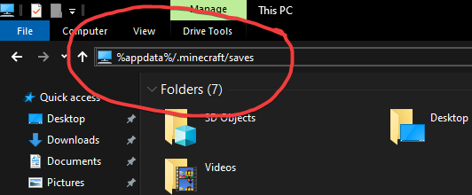
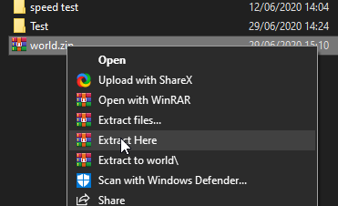
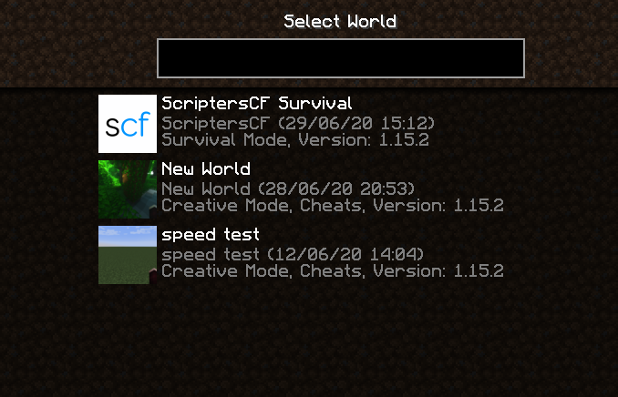

# mc-server-install
Want to continue playing on our original survival world? Find out how to install the world here.

# How to Install
- **Download World:** [scf.cx/mc-world-1](https://drive.google.com/file/d/1b2pMw_gfqEiR52WzNsKcYbtVQC67JQ01/view?usp=sharing)
- Navigate to `%appdata/.minecraft/saves` to view your saves in the File Explorer

- Paste the downloaded world in the saves folder and extract it

- Find the world in your single player menu and play as normal

